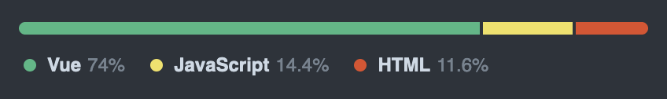
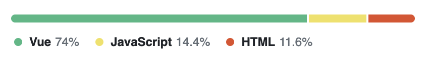

# Linguistical 📊

GitHub language stats Vue component




A near perfect replica of the GitHub language stats graph built for Vue. Pulls code data right from your repository so it is always up to date.

Great for

- portfolio sites
- project wikis
- and more

## Getting Started

1. Install the [GitHub app](https://github.com/apps/linguistical-app) so Linguistical can access your data
2. Install the Linguistical library to your Vue project: `npm i linguistical`
3. Import and implement the component anywhere in your project (don't forget the CSS!). Make sure to pass it your username and the repository name that you want to pull stats from:

```vue
<script>
import Linguistical from 'linguistical'
import('linguistical/dist/style.css')
</script>

<template>
  <Linguistical user="username" repo="reponame" />
</template>
```

## Customization

Currently Linguistical supports two themes: `light` and `dark`. `light` is default. The styling is copied from GitHub's light and dark themes.

Theming is controlled with the `theme` prop:

```vue
<Linguistical theme="dark" user="username" repo="reponame" />
```

## Contribution

To run the demo app:

```sh
npm install
npm run dev
```

### Recommended IDE Setup

- [VS Code](https://code.visualstudio.com/) + [Volar](https://marketplace.visualstudio.com/items?itemName=Vue.volar) (and disable Vetur) + [TypeScript Vue Plugin (Volar)](https://marketplace.visualstudio.com/items?itemName=Vue.vscode-typescript-vue-plugin).
